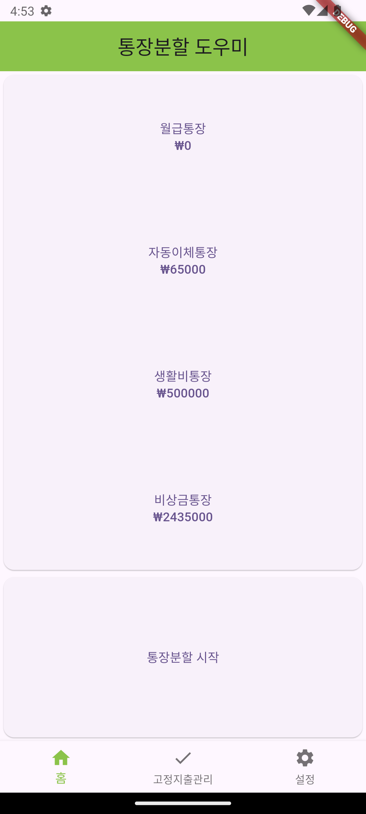
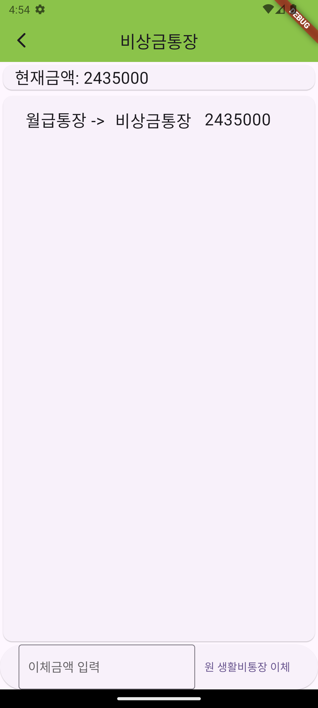

## 통장분할도우미

---
통장4분할법을 사용하여 통장을 정리하는 것을 도와주는 어플리케이션

### 실행화면

    <table>
        <tr>
            <td colspan ='3'>Setting</td>
        <tr>
            <td></td>
            <td></td>
            <td></td>
        </tr>
    </table>

    <table>
        <tr>
            <td colspan ='5'>통장분할</td>
        <tr>
            <td></td>
            <td></td>
            <td></td>
            <td></td>
            <td></td>
        </tr>
    </table>

    <table>
        <tr>
            <td colspan ='4'>View</td>
        <tr>
            <td></td>
            <td></td>
            <td></td>
            <td></td>
        </tr>
    </table>

### 사용기술
- Dart
- Flutter

### 사용 라이브러리
- Drift 